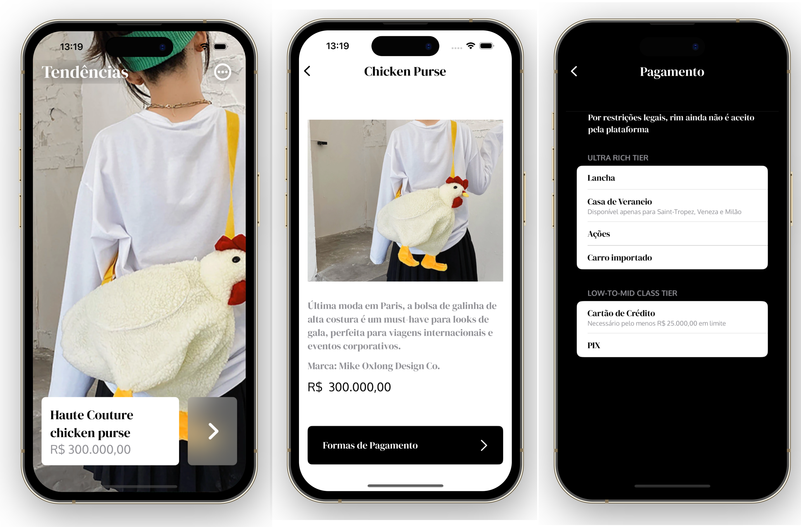

# Oppulence

## Ouse. Inove. Arrase!
Oppulence é a loja perfeita para os exclusivistas, criadores de tendências, ícones da moda. Para aqueles que "básico" não é uma opção. Seja bem-vindo ao novo nível da moda!

# Projeto

- Requisitos: XCode 14, Swift, SwiftUI
- Não, nada de Storyboards, XIBs e ViewCode! Nesse projeto será usada única e exclusivamente tecnologias "bleeding-edge" no desenvolvimento iOS
- Oppulence é "concept-driven": os itens implementados são guiados puramente pela imaginação criativa, não por regras de negócio nem por regras de retrocompatibilidade. A única regra é que a interface precisa SEMPRE ser absolutamente fabulosa, seja em usabilidade ou em beleza dos componentes
- Sugestões de melhoria de código são sempre bem-vindas (podem ser feitas via pull request ou via email - thalles.araujo@yandex.com)

# Inspirações e assets de design

Oppulence é inspirado pela Haute Couture e pelo mercado de luxo, buscando sempre trazer elementos de opulência, sofisticação e bom gosto à sua proposta de usabilidade.

## Fontes escolhidas:

Branding: DM Serif Display (https://fonts.google.com/specimen/DM+Serif+Display?query=DM)

Complimentary: Oxygen (https://fonts.google.com/specimen/Oxygen?query=Oxygen)

